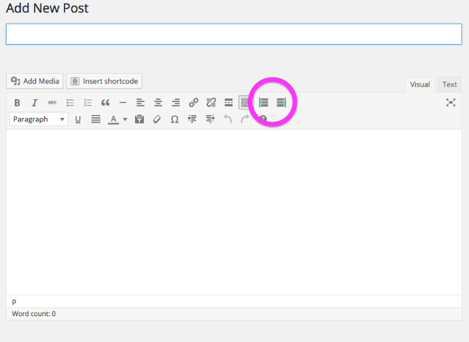
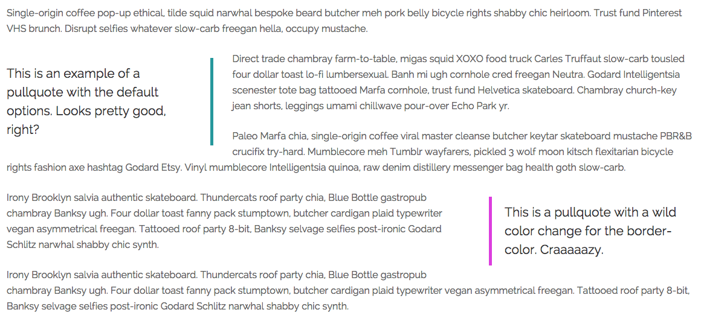

# Pullquote Plugin

A Wordpress theme plugin to add left or right-aligned pullquotes. Also includes two custom buttons for the TinyMCE Editor.

## INSTALLATION
1. [Download the repo](https://github.com/adamdehaven/perfect-pullquotes/archive/master.zip) and copy the unzipped folder into your active Wordpress theme's folder. The path should look similar to what is seen here:
<pre>example.com / wp-content / themes / Theme_Name / perfect-pullquotes</pre>

2. Insert the line of PHP from <code>require-code.php</code> into your theme's <code>functions.php</code> file. Only include the line shown below.
<pre>require ('perfect-pullquotes/pullquote-shortcode.php');</pre>

3. Copy the CSS from <code>pullquote.css</code> into your theme's <code>styles.css</code> file.

4. Upload all of the changed files to your server. The files being uplaoded should include:
 * The entire <code>perfect-pullquotes/</code> directory
 * Your theme's <code>functions.php</code> file
 * Your theme's <code>styles.css</code> file

To change the default color of the pullquote’s border, edit lines <code>51</code> and <code>59</code> of the <code>pullquote.css</code> file, or simply utilize the “color” option included within the shortcode.

Once installed, the plugin will add two Pullquote buttons to the Visual Editor (TinyMCE) within your Wordpress installation as seen below

## SHORTCODE
The plugin enables a [Wordpress shortcode](https://codex.wordpress.org/Shortcode_API) that allows the user to add a pullquote within their content. The shortcode can be added manually, or by selecting text in the text editor and then clicking either of the Pullquote buttons (one for left-aligned, the other for right-aligned).

The default shortcode tag is shown here
<pre>[pullquote align="left" color="" class=""]This is the pullquote text.[/pullquote]</pre>

## OPTIONS
The shortcode includes three options, as outlined below.

Option | Accepts | Description | Example
--- | --- | --- | ---
<code>align</code> | <code>left</code> or <code>right</code> | Determines whether pullquote is left or right aligned. **Required** | <code>[pullquote align="left"][/pullquote]</code>
<code>color</code> | [HEX](http://www.colorhexa.com/) color code | Change the default <code>border-color</code> attribute by entering a valid HEX color, including the <kbd>#</kbd> | <code>[pullquote align="left" color="#16989D"][/pullquote]</code>
<code>class</code> | text | Add class(es) to pullquote container. **Optional** | <code>[pullquote align ="right" class="cited author-quote"][/pullquote]</code>

## EXAMPLES

Below are a series of paragraphs (filler text) with pullquotes inserted:

