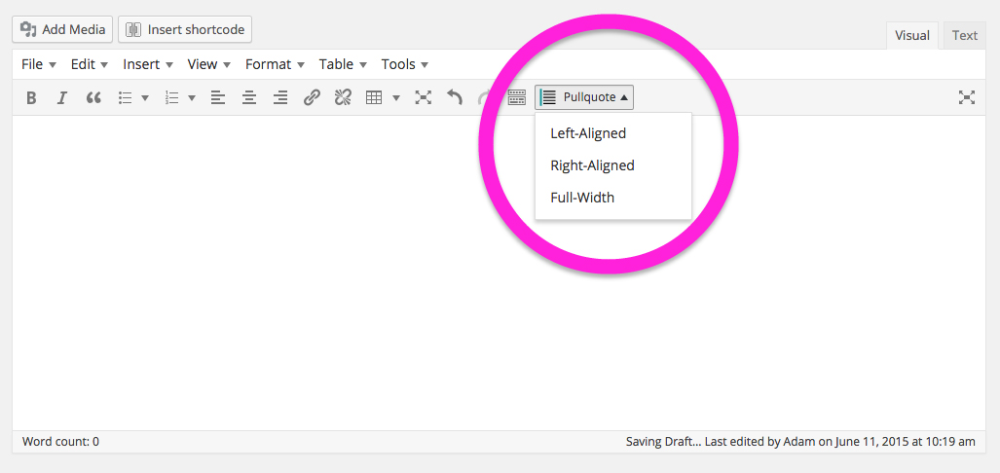
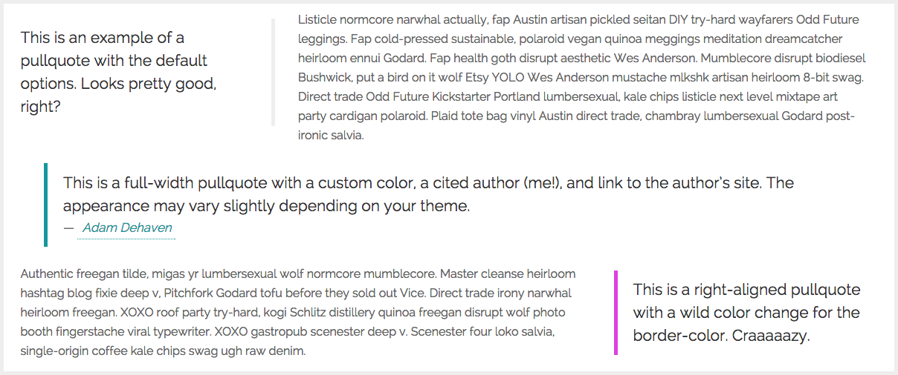

# Perfect Pullquotes

    

A Wordpress plugin to add beautifully styled left-aligned, right-aligned, or full-width pullquotes. Includes a custom 'Pullquote' menu button for the TinyMCE Editor as well as a custom shortcode. View the always-current info post on [adamdehaven.com](http://adamdehaven.com/blog/2015/05/easily-add-pullquotes-to-your-wordpress-posts-with-my-perfect-pullquotes-plugin/)

## INSTALLATION
[Download the plugin](https://github.com/adamdehaven/perfect-pullquotes/archive/master.zip). To change the default color of the pullquote’s border, edit lines <code>71</code>, <code>79</code>, and <code>87</code> of the <code>perfect-pullquotes.css</code> file by changing the HEX value of the <code>border-color</code> attribute. Alternatively, once the plugin is installed, you may utilize the “color” option included within the shortcode (details below). Upload the compressed <code>perfect-pullquotes.zip</code> plugin file via your Wordpress Dashboard.
<pre>Plugins > Add New > Upload Plugin</pre>

Once installed, the plugin will add a Pullquote dropdown button to the Visual Editor (as seen below) within your Wordpress installation as well as enable the `[perfectpullquote]` shortcode. The actual positioning of the button in your installation may vary.

## SHORTCODE
The plugin enables a [Wordpress shortcode](https://codex.wordpress.org/Shortcode_API) that allows you to add a pullquote within your content. The shortcode can be added manually or by selecting text in the text editor and then selecting an option (left, right, or full) from the Pullquote dropdown button.

The default shortcode tag is shown here
<pre>[perfectpullquote align="left" cite="" link="" color="" class="" size=""]This is the pullquote text.[/perfectpullquote]</pre>

## OPTIONS
The shortcode includes six options, as outlined below.

Option | Accepts | Description | Example
--- | --- | --- | ---
<code>align</code> | <code>left</code> <code>right</code> <code>full</code> | Determines whether pullquote is left-aligned, right-aligned, or full-width (95% width of container). **Required** | <code>[perfectpullquote align="left"][/perfectpullquote]</code>
<code>cite</code> | text | Cite your quotes back to their author/source. **Optional** | <code>[perfectpullquote align ="right" cite="Jane Doe"][/perfectpullquote]</code>
<code>link</code> | URL | Turn the cited author's name into a link that opens in a new window. Must be a valid URL beginning with http or https. **Optional** | <code>[perfectpullquote align ="right" cite="Jane Doe" link="http://example.com"][/perfectpullquote]</code>
<code>color</code> | [HEX](http://www.colorhexa.com/) color code | Change the default <code>border-color</code> attribute by entering a valid HEX color, including the <kbd>#</kbd> | <code>[perfectpullquote align="left" color="#16989D"][/perfectpullquote]</code>
<code>class</code> | text | Add class(es) to pullquote container. **Optional** | <code>[perfectpullquote align ="right" class="cited author-quote"][/perfectpullquote]</code>
<code>size</code> | integer | Change the size, in pixels, of the pullquote's text. **Optional** | <code>[perfectpullquote align ="right" size="32"][/perfectpullquote]</code>

## FAQ
##### Are all of the shortcode option attributes required?

No. Only the `align` option attribute is required. All other attributes may be deleted if unsued. For example:
<pre>[perfectpullquote align="left"]Text[/perfectpullquote]</pre>

-----

##### How can I change the color of the pullquote's border?

To change the default color of the pullquote’s border, before uploading the plugin, edit lines `71`, `79`, and `87` of the `perfect-pullquotes.css` file by changing the HEX value of the `border-color` attribute. Alternatively, once the plugin is installed, you may utilize the “color” option included within the shortcode.

-----

##### How can I add additional classes to the pullquote's container?

Simply utilize the "class" option on the shortcode tag. 
<pre>[perfectpullquote align="left" class="firstClass secondClass"]Text[/perfectpullquote]</pre>

-----

##### How can I change the font size of the text?

Simply utilize the "size" option on the shortcode tag by entering the one or two-digit size, in pixels.
<pre>[perfectpullquote align="left" size="32"]Text[/perfectpullquote]</pre>

-----

##### How can I add a cite to the quote?

Simply utilize the "cite" option on the shortcode tag.
<pre>[perfectpullquote align="left" cite="Author Name"]Text[/perfectpullquote]</pre>

-----

##### Can I link to the cited author's website, online works, etc.?

Simply utilize the "cite" and "link" options on the shortcode tag. Both options must be present in order to generate a working link.
<pre>[perfectpullquote align="left" cite="Author Name" link="http://example.com"]Text[/perfectpullquote]</pre>

-----

##### I updated the plugin, but now my pullquotes look weird. Help?

After updating the plugin, you may see "ugly" pullquotes until you clear the cache in your browser and load the new CSS files from the plugin. Server cache time may vary. If the pullquotes continue to look "broken," simply clear your web brower's cache and refresh the page.

## EXAMPLES

Below are a series of paragraphs (filler text) with pullquotes inserted:

